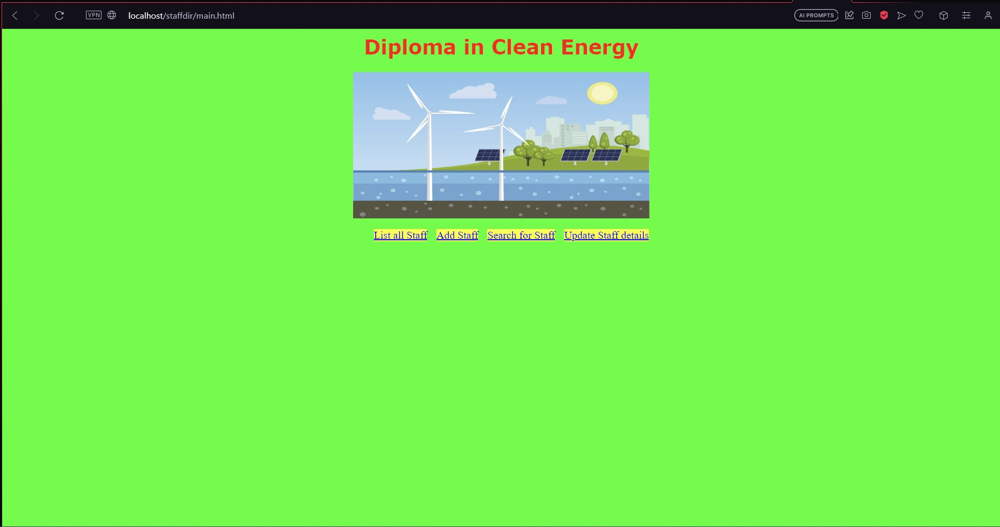
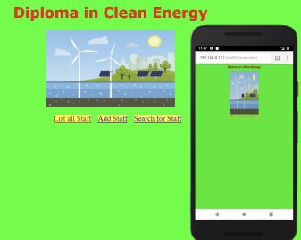
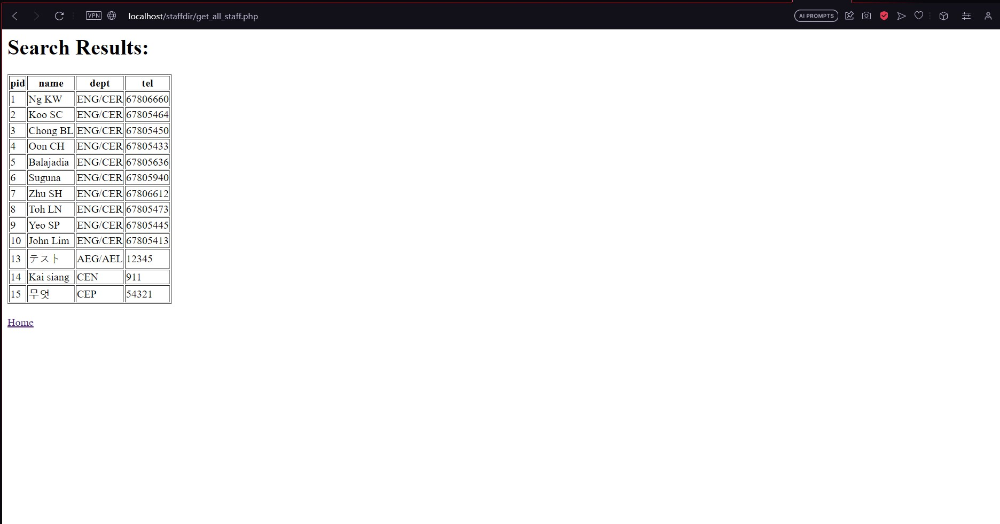
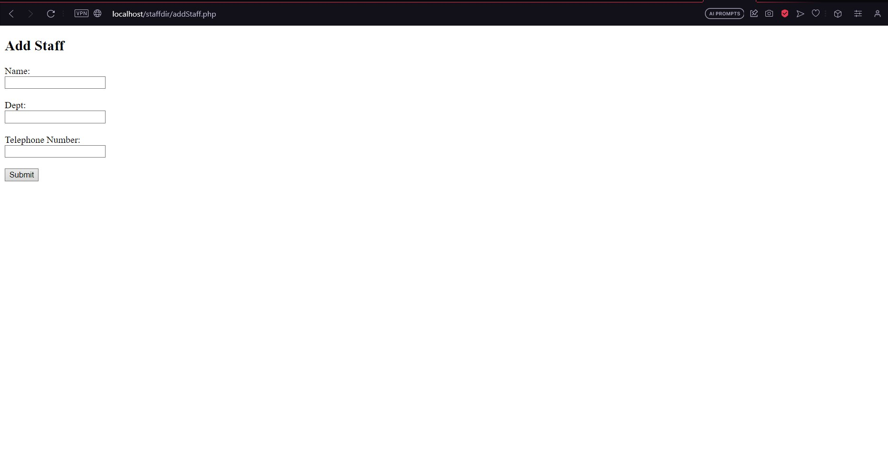
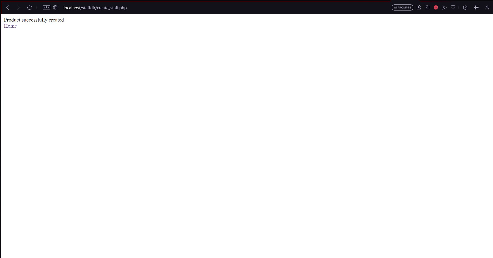
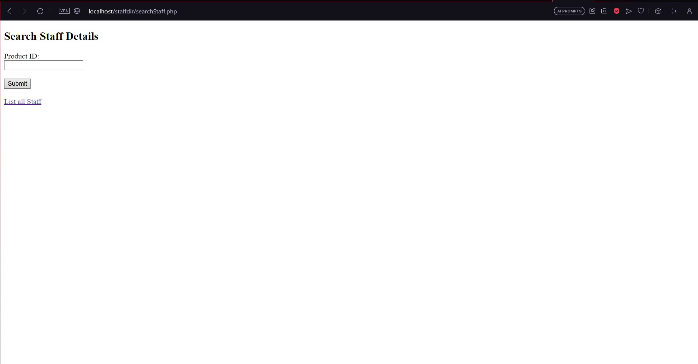
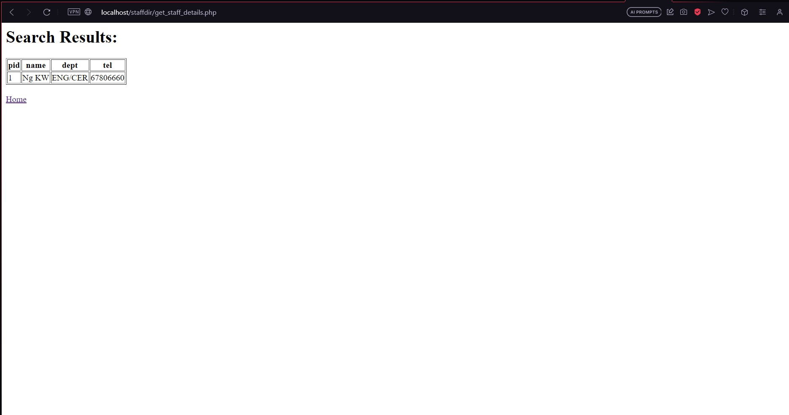

# Web Application for Clean Energy

### Project Scenario
I was assigned this project during a higher engineering skills workshop conducted at Temasek Polytechnic. The objective of the project was to test my understanding for what was taught during the workshop, which was to develop a mobile web page using PHP and MySQL to create a staff directory for the Diploma in Clean Energy. I was also tasked with running the web server application on an Android virtual device in Android Studio.

### Functions and Requirements
- Design a page that allows users to view a directory of all staff members
- Create a page that allows users to add new staff members to the database
- Create a page that allows users to search for staff members by ID number
- Design a page that allows users to update staff member information

### Main page
 
 

### List all Staff
 

### Add Staff
 
 

### Search Staff
 
 

